## Table of Contents

- [Logo](#logo)
- [Project Overview](#welcome-to-my-final-project-in-this-life-changing-course)
- [UI/UX](#uiux)
  - [Colors](#colors)
  - [Fonts](#fonts)
  - [Imagery](#imagery)
- [Features](#features)
  - [Existing Features](#existing-features)
  - [Features Left to Implement](#features-left-to-implement)
  - [Business Plan](#business-plan)
- [Lucid Chart & ERD](#lucid-chart--erd---entity-relationship-diagram)
- [Testing](#testing)
  - [Validator Testing](#validator-testing)
  - [Unfixed Bugs](#unfixed-bugs)
- [Deployment](#deployment)
- [Credits](#credits)
- [Glossary](#glossary)

[Database Structure](#database-structure)

[Site Structure](#site-structure)

[Store Structure](#ecommerce-store-stucture)
  - [Admin](#admin)
  - [Home app](#homepage)
  - [Navigation](#navigation)
  - [Footer](#footer)
  - [Registration](#registration)
  - [Cart app](#bag-app)
  - [Checkout app](#checkout-app)
  - [Products app](#products-app)
  - [Profiles app](#profile-app)

[Online Marketing](#online-marketing)
  - [Search Engine Optimisation](#search-engine-optimisation)
  - [Compliance](#compliance)

[Future Implementations](#future-implementations)

[Deployment](#deployment)
  - [Installing Libraries](#installing-libraries)
  - [PostgreSQL database](#create-a-postgresql-database-using-elephantsql)
  - [Hiding Sensitive Information](#hiding-sensitive-information)
  - [Update Settings](#update-settings)
  - [Connecting Cloudinary](#connect-to-cloudinary)
  - [Deploy to Heroku](#allow-heroku-as-host)
  - [Debug Status](#debug-status)
  - [Fork Repository](#fork-the-repository)
  - [Clone Repository](#clone-the-repository)

[Technologies Used](#technology-used)
  - [Front End Tech](#front-end)
  - [Back End Tech](#back-end)
  - [Additional resources](#additional-technology-resources)

[Acknowledgements](#acknowledements)

[Retrospective](#retrospective)

**Welcome to my final project in this life-changing course!**

This journey has been an eye-opener in so many ways, and for my final project, I chose something deeply personal and creatively fulfilling: **Print & Design**.

At 44, I bring a wide range of experience to the table—from logistics and marketing to design—and I've always been drawn to projects where these skills can come together in a meaningful way. With this in mind, and in collaboration with my sister-in-law Wilri (who’s based in the USA), the idea of launching a **printing website** was born.

The core concept is simple but powerful: customers can either upload and print their **own designs** at competitive prices, or browse and purchase from a curated selection of **pre-designed products**. These include everything from business cards and posters to t-shirts, stationery, and more. The idea is to provide flexibility and creativity—whether you're a small business owner, an artist, or just someone who wants to create something unique.

As I’ve learned throughout this course, the future of design is increasingly digital, and I didn’t want to ignore that. That’s why the platform also aims to offer a growing selection of **digital products**, such as downloadable templates, planners, and design resources. While this part is still under development, it's an exciting area with huge potential and will definitely be a key component of the business moving forward.

For inspiration, I’ve looked at platforms like **Wirmachendruck** in Germany and **Upwork** in the US. These websites have helped shape my vision—though I've quickly realized that bringing even a simplified version of this idea to life is a massive undertaking. I could have chosen an easier project, like creating a basic e-commerce site selling a handful of my favorite vitamins... but that’s just not how I’m wired. I like to dream big, even if it means more work.

While the site you see now is an MVP (Minimum Viable Product), I hope it clearly reflects the direction I’m heading. There’s still a lot to do—features to build, a new name to choose (since the current one is just a placeholder), and many refinements to make. But the foundation is here, and I’m committed to turning this into a fully functioning, customer-centric platform.

Thank you for taking the time to check it out—and I truly hope you can see the potential this project holds.

---
### Deployment Links
[Heroku](https://print-design-d837920c6712.herokuapp.com)

[Github](https://github.com/LanaD-cell/Print-Design)

## UI/UX

### Colors
[Coolers](https://coolors.co)
  - The colorpallet was created on Coolers and chosen specifically for the following reasons:

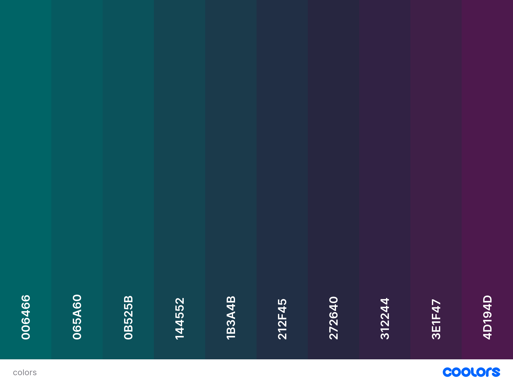

This color offers a rich gradient that moves from deep teals into midnight blues and ends with moody purples. It’s bold, modern, and slightly mysterious—perfect for creating a distinctive, professional, and creative look for a printing website.
Here's a breakdown of the emotional feel and meaning behind each color group in this palette:

#### Teals (Hex: #006466 to #0B525B)
  - These colors feel fresh, clean, and trustworthy. Teal shades often symbolize:
   - Stability & reliability – great for building user confidence.
   - A sense of calm professionalism – ideal for business platforms.
   - A tech-savvy and design-forward impression.

#### Deep Blues (Hex: #144552 to #212F45)
  - Dark blues bring depth and authority, while still being elegant. These colors suggest:
   - Seriousness and trust – ideal for a business that wants to appear reliable.
   - A creative night-time vibe, which plays well into digital design and artistic freedom.
   - Luxury and intelligence, perfect for showcasing pre-designed high-end products.

#### Purples (Hex: #272640 to #4D194D)
  - As we transition into purples, the mood shifts to something more expressive and imaginative. Purples evoke:
   - Creativity and innovation – aligns beautifully with custom design offerings.
   - A hint of mystery and sophistication – which can make your site feel premium.
   - Inspiration and individuality – perfect for a platform that enables personal expression through printing.

#### Overall Feel for a Printing Website:
  - This palette communicates a brand that is:
   - Modern and creative, but still professional
   - Reliable and premium-feeling
   - Designed to appeal to customers who care about aesthetics, personalization, and quality

### Fonts

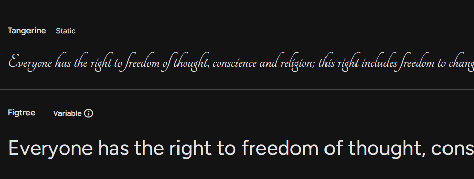
[Google Fonts](https://fonts.google.com/)

#### Both Tangerine and Figtree complement each other beautifully and bring unique emotional tones that suit a printing and design website perfectly.
  - Here's a breakdown of why they work and what they bring to your project:

Tangerine – Elegant Script Font
  - Tangerine is a delicate, flowing script font that feels artistic and refined.
  - It brings:
   - A personal, handcrafted touch – which ties in nicely with the custom design and print-your-own concept of your site.
   - Elegance and romance – great for design elements aimed at weddings, invitations, or personalized stationery.
   - A sense of individuality and flair, giving your brand a creative edge.

Figtree – Clean, Modern Sans-Serif
  - Figtree is a highly legible and modern sans-serif typeface that communicates clarity, accessibility, and trustworthiness.
  - It brings:
   - Professionalism with a friendly tone – ideal for body text, menus, and product descriptions.
   - A tech-savvy and user-focused vibe – makes navigating the site easy and enjoyable.
   - Versatility – great for both web and print, ensuring your site feels cohesive across platforms.

### Imagery

[Cloudinary](https://cloudinary.com)
    - Cloudinary offers a streamline independant image storage system.

[Freepik](https://www.freepik.com)
    - All imagery and Mascots were created using the AI Image creator funtionality of Freepiks.

[Kapwing](https://www.kapwing.com)
    - Mockup generator for Social media sites.

## Features

### Existing Features

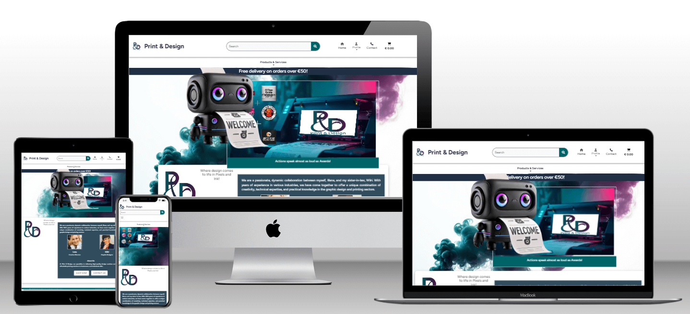

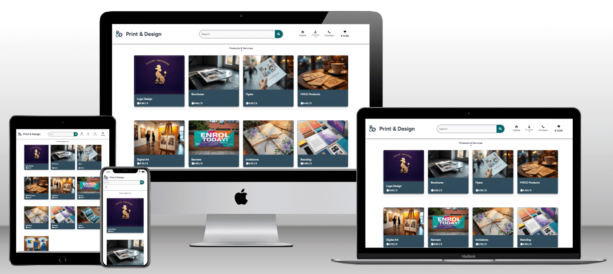

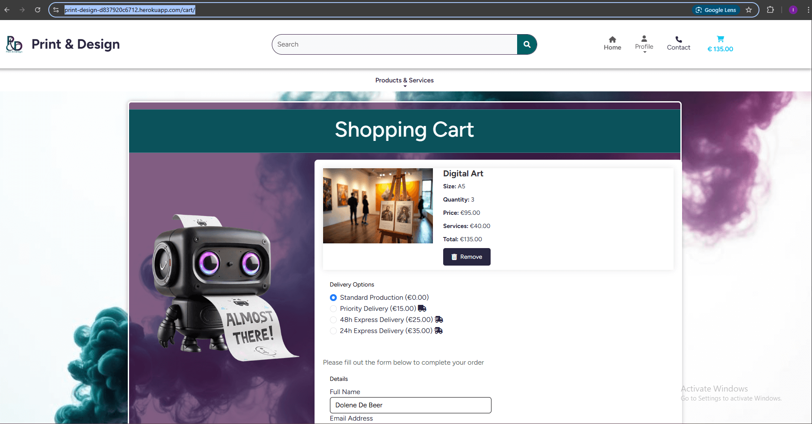

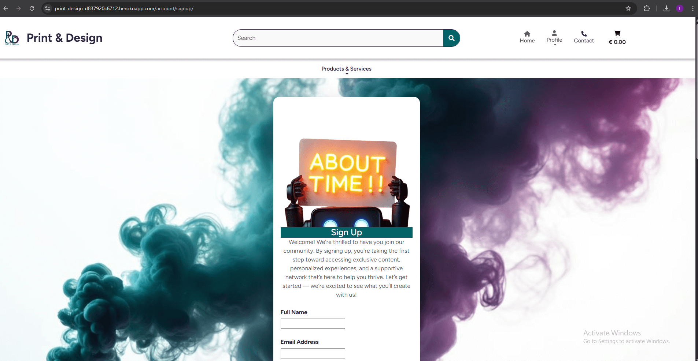

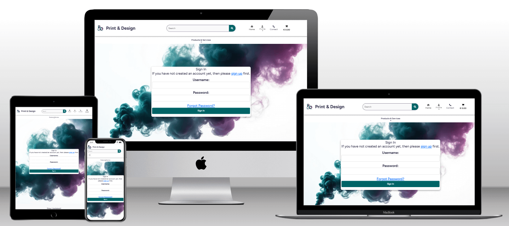

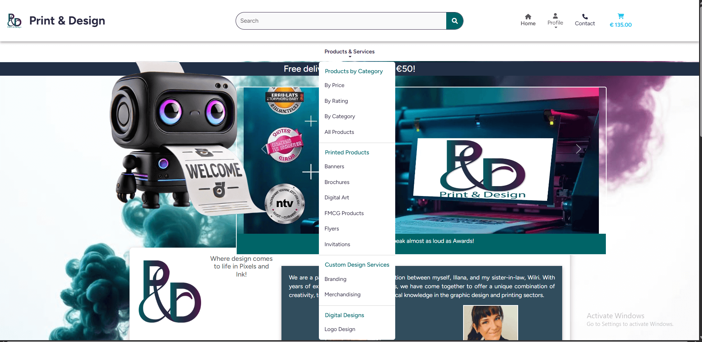

### Features Left to Implement

- Another feature idea

## Bunsiness Plan

   1. Executive Summary

    Business Name: Print & Design
    Business Model: Online-based printing and digital design services
    Location: Operates primarily online, with a centralized production hub
    Mission Statement: To provide high-quality, affordable, and efficient printing and design services for individuals, businesses, and organizations through an easy-to-use online platform.
    Vision: To become a leading online destination for customizable print products and digital design services.

   2. Business Objectives

    - Launch a fully functional e-commerce website within 3 months
    - Attain 1,000 unique monthly customers within the first year
    - Partner with at least 10 small-to-medium businesses for recurring print needs
    - Break even within 18 months of operation

   3. Products & Services

    Printing Services:
    - Business Cards
    - Flyers & Brochures
    - Posters & Banners
    - Stickers & Labels
    - Custom Packaging
    - Invitations & Event Materials

    Digital Design Services:
    - Logo Design
    - Branding Packages
    - Social Media Graphics
    - Custom Illustrations
    - Templates (Business presentations, pitch decks, etc.)

    Additional Offerings:
    - Print-ready file reviews
    - Custom quote requests
    - Rush delivery options

   4. Market Analysis

    Target Audience:
    - Small business owners
    - Freelancers and creatives
    - Event organizers
    - Students and educational institutions
    - Nonprofits and community organizations

    Market Trends:
    - Growing demand for personalized and print-on-demand services
    - Shift toward online platforms for design and printing needs
    - Increasing importance of brand identity and visual presentation

    Competitors:
    - Vistaprint
    - Canva Print
    - Moo
    - Local print shops with online ordering

    Competitive Advantage:
    - Integrated digital design with print service
    - Quick turnaround times and competitive pricing
    - User-friendly platform with templates and drag-and-drop tools
    - Strong customer support and file-proofing services

   5. Marketing Strategy

    Channels:
    - SEO-optimized website and blog
    - Social media marketing (Instagram, Facebook, LinkedIn)
    - Email marketing campaigns
    - Google Ads and paid social media promotions
    - Partnering with local businesses and influencers

    Promotions:
    - Launch discounts
    - Referral program
    - Seasonal sales
    - Loyalty rewards for repeat customers

   6. Operations Plan

    Platform Development:
    - Custom-built or Shopify/Wix integration with print plugins
    - Design upload, preview, and order-tracking system

    Production & Fulfillment:
    - In-house printing facility or third-party fulfillment partner
    - Quality control systems and packaging standards
    - Courier partnerships for delivery

    Customer Service:
    - Live chat, email, and ticketing support
    - FAQ and self-help resources

   7. Management Team

    - Founder/CEO: Oversees strategy, partnerships, and financial planning
    - Creative Director: Leads design team and develops templates
    - Marketing Manager: Handles brand visibility, outreach, and digital campaigns
    - Web Developer: Maintains and improves the platform

   8. Financial Plan

    Startup Costs:
    - Website and e-commerce development: €8,000
    - Printing equipment or initial outsourcing: €15,000
    - Marketing and branding: €5,000
    - Operational overhead (licenses, hosting, etc.): €3,000

    Revenue Model:
    - Per-product sales
    - Design service packages
    - Subscription plans for businesses with regular print needs

    Year 1 Projections:
    - Revenue: €80,000
    - Expenses: €60,000
    - Profit: €20,000

   9. Risk Analysis

    Potential Risks:
    - Technical website issues or downtime
    - Delays in order fulfillment
    - High competition
    - Changing customer preferences

    Mitigation:
    - Regular platform maintenance and testing
    - Backup fulfillment partners
    - Strong brand identity and unique value proposition
    - Feedback loops to adapt services

## Lucid Chart & ERD - Entity-Relationship Diagram

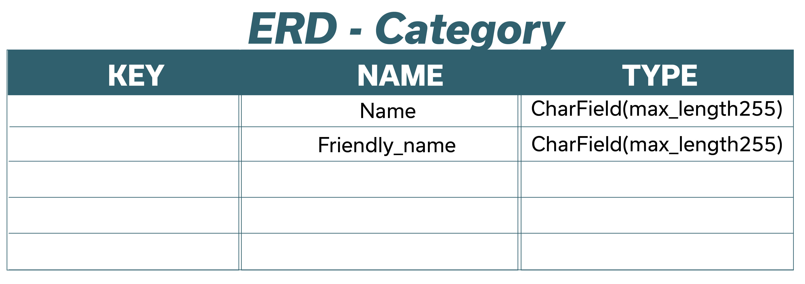
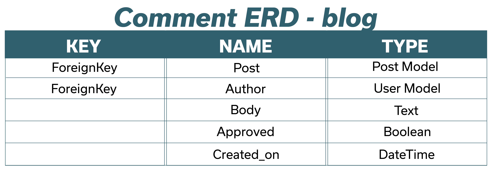
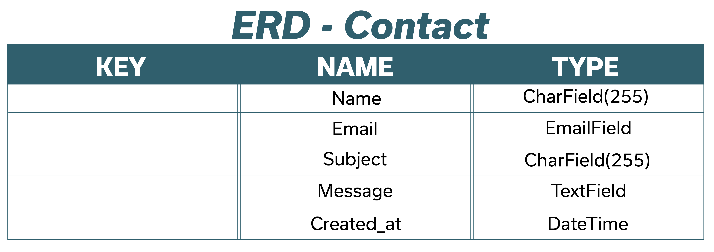
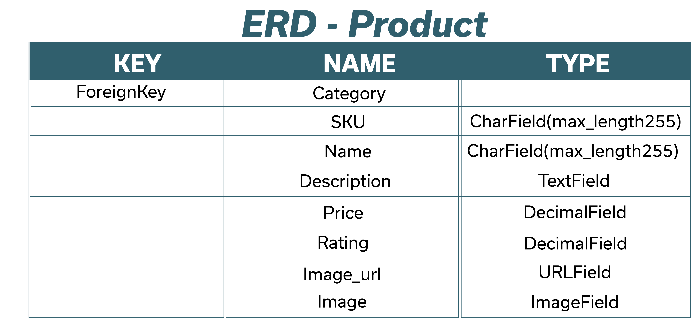
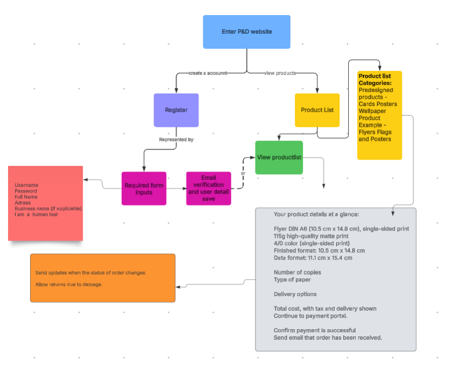

## Testing

In this section, you need to convince the assessor that you have conducted enough testing to legitimately believe that the site works well. Essentially, in this part you will want to go over all of your project’s features and ensure that they all work as intended, with the project providing an easy and straightforward way for the users to achieve their goals.

In addition, you should mention in this section how your project looks and works on different browsers and screen sizes.

You should also mention in this section any interesting bugs or problems you discovered during your testing, even if you haven't addressed them yet.

If this section grows too long, you may want to split it off into a separate file and link to it from here.

### Validator Testing

- HTML
  - No errors were returned when passing through the official [W3C validator](https://validator.w3.org/nu/?doc=https%3A%2F%2Fcode-institute-org.github.io%2Flove-running-2.0%2Findex.html)
- CSS
  - No errors were found when passing through the official [(Jigsaw) validator](https://jigsaw.w3.org/css-validator/validator?uri=https%3A%2F%2Fvalidator.w3.org%2Fnu%2F%3Fdoc%3Dhttps%253A%252F%252Fcode-institute-org.github.io%252Flove-running-2.0%252Findex.html&profile=css3svg&usermedium=all&warning=1&vextwarning=&lang=en#css)

### Bugs

  #### Secret Key commited
    - I added the SK to the Js in order_checkout js for testing purposes, as the payment was throuwing Invalid Client Secret errors.
      Then I forgot to remove it before committing changes and opened a can of worms. I received a fatal error that Github piscked up that a SK was commit and refused access. I then proceeded to do a major rebate on all commits. After that I once again received the same error, as the commit was stuck in the history eventhough I did the rebate. After some restless sleep, I throught of just changing my SK in Stripe and allowing the old SK to be sent through as a test SK to Guthub. On the surface it seems to have worked.

## Deployment

This section should describe the process you went through to deploy the project to a hosting platform (e.g. GitHub)

- The site was deployed to GitHub pages. The steps to deploy are as follows:
  - In the GitHub repository, navigate to the Settings tab
  - From the source section drop-down menu, select the Master Branch
  - Once the master branch has been selected, the page will be automatically refreshed with a detailed ribbon display to indicate the successful deployment.

The live link can be found here - https://code-institute-org.github.io/love-running-2.0/index.html

## Credits

In this section you need to reference where you got your content, media and extra help from. It is common practice to use code from other repositories and tutorials, however, it is important to be very specific about these sources to avoid plagiarism.

You can break the credits section up into Content and Media, depending on what you have included in your project.

### Content

- The text for the Home page was taken from Wikipedia Article A
- Instructions on how to implement form validation on the Sign Up page was taken from [Specific YouTube Tutorial](https://www.youtube.com/)
- The icons in the footer were taken from [Font Awesome](https://fontawesome.com/)

### Media

- The photos used on the home and sign up page are from This Open Source site
- The images used for the gallery page were taken from this other open source site

Congratulations on completing your Readme, you have made another big stride in the direction of being a developer!

## Other General Project Advice

Below you will find a couple of extra tips that may be helpful when completing your project. Remember that each of these projects will become part of your final portfolio so it’s important to allow enough time to showcase your best work!

- One of the most basic elements of keeping a healthy commit history is with the commit message. When getting started with your project, read through [this article](https://chris.beams.io/posts/git-commit/) by Chris Beams on How to Write  a Git Commit Message
  - Make sure to keep the messages in the imperative mood

- When naming the files in your project directory, make sure to consider meaningful naming of files, point to specific names and sections of content.
  - For example, instead of naming an image used ‘image1.png’ consider naming it ‘landing_page_img.png’. This will ensure that there are clear file paths kept.

- Do some extra research on good and bad coding practices, there are a handful of useful articles to read, consider reviewing the following list when getting started:
  - [Writing Your Best Code](https://learn.shayhowe.com/html-css/writing-your-best-code/)
  - [HTML & CSS Coding Best Practices](https://medium.com/@inceptiondj.info/html-css-coding-best-practice-fadb9870a00f)
  - [Google HTML/CSS Style Guide](https://google.github.io/styleguide/htmlcssguide.html#General)

Getting started with your Portfolio Projects can be daunting, planning your project can make it a lot easier to tackle, take small steps to reach the final outcome and enjoy the process!

### References
https://stackoverflow.com/questions/68700028/bootstrap-collapse-does-not-work-correctly-closes-immediately-after-opening

https://www.w3schools.com/bootstrap/bootstrap_collapse.asp

https://stackoverflow.com/questions/63150304/typeerror-object-of-type-decimal-is-not-json-serializable-django

https://stackoverflow.com/questions/77561034/add-same-product-with-different-sizes-and-prices-to-the-cart

https://youtu.be/4NqAiqdjMI8?si=IG5k_PtosZlD2NeR

https://youtu.be/lKyH_ZGtvwM?si=AqFpK4ZGy8x5RI8E

https://youtu.be/E8SvbOcqMGA?si=m1BJ2QtEIKKtdgg3

https://forum.djangoproject.com/t/stripe-webhook-not-working-in-django-view/39163

https://stackoverflow.com/questions/62161406/django-stripe-payment-does-not-respond-after-clicking-the-submit-payment-button

https://youtu.be/VuSiSCIiBgk?si=pz8aYsIKnqq2gujz

https://stackoverflow.com/questions/70656467/stripe-card-element-isnt-visible-python-django

https://stackoverflow.com/questions/73551188/how-to-trigger-confetti-with-if-condition

https://stackoverflow.com/questions/49958248/django-cleaned-data-getobj-method-returns-none

https://www.youtube.com/watch?v=QKfRC3IOh_k

https://github.com/craftcms/commerce-stripe/issues/223

## Glossary

**MVP (Minimum Viable Product)**
A basic, working version of a product with just enough features to be functional, used to test an idea or gather feedback.

**ERD (Entity Relationship Diagram)**
A visual representation of data and how different entities (like users, products, or orders) relate to one another in a database.

**UI (User Interface)**
The part of a website or app that users interact with—buttons, layout, menus, etc.

**UX (User Experience)**
The overall experience a user has with a website, including how easy and enjoyable it is to use.

**Responsive Design**
A design approach that ensures a website looks and works well on all screen sizes, from phones to desktops.

**Lucidchart**
An online diagram tool used to create wireframes, ERDs, flowcharts, etc.

**XML Sitemaps**
An online sitemap generator. (https://www.xml-sitemaps.com/details-print-design-d837920c6712.herokuapp.com-92b283b88.html)

**Coolors**
An online tool for generating and sharing color palettes.

**Google Fonts**
A web-based library of free fonts hosted by Google, commonly used in websites and applications.

**Mockup**
A visual representation of what a website or product will look like, used for design and feedback.

**Deployment**
The process of making a website or app live and accessible online, typically via services like GitHub Pages or Heroku.

**Validator**
A tool used to check if your code (HTML, CSS) follows proper syntax and rules.

