# Print and Design Testing Information

This is the testing information for my project 5 eCommerce store Print & Design

[READ ME IS HERE](https://github.com/LanaD-cell/Print-Design) | DEVELOPER: Illana De Beer | [LinkedIn](https://linkedin.com/in/illana-de-beer-026332198)

<br>

## CONTENTS

[Features Testing](#features-testing)

[Admin Features](#admin-features)


[Store Features](#store-features)
- [Home Page Features](#home-page-features)
- [Navigation Bar Features](#navigation-bar-features)
- [Authentication Pages](#authentication-pages)
- [Products Page](#products-page)
- [Product Detail & Reviews](#product-detail-page)
- [Checkout Page](#checkout-page)
- [Profile Page](#profile-page)
- [Contact Us Page](#contact-us-page)
- [Wish List Page](#wish-list-page)
- [Newsletter Page](#newsletter-page)
- [Events Page](#events-page)
- [Compliance Pages](#compliance-pages)
- [Footer](#footer)

[UI Testing](#ui-testing)

[Browser Compatibility](#browser-compatibility)

[Responsiveness](#responsiveness)

[Code Validation](#code-validation)

- [CSS Validation](#css-validation)

- [JavaScript Validation](#javascript-validation)

- [HTML Validation](#html-validation)

<br>

[Lighthouse Validation](#lighthouse-validation)

- [index](#index-page)
- [registration](#registration-page )
- [login](#login-page)
- [forgotten password](#forgotten-password-page)
- [products page](#products-page-1)
- [checkout page](#checkout-page-1)
- [checkout success page](#checkout-success-page)
- [contact us page](#contact-us-page-1)
- [newsletter page](#newsletter-page-1)
- [event page](#event-page)

[Behaviour Driven Testing](#behaviour-driven-testing)

[Automated Testing](#automated-testing)

[Bugs](#bugs)

[Resources](#resources)

[Retrospective](#retrospective)

<br>

### Validator Testing

- HTML
  - No errors were returned when passing through the official [W3C validator](https://validator.w3.org/nu/?doc=https%3A%2F%2Fcode-institute-org.github.io%2Flove-running-2.0%2Findex.html)
- CSS
  - No errors were found when passing through the official [(Jigsaw) validator](https://jigsaw.w3.org/css-validator/validator?uri=https%3A%2F%2Fvalidator.w3.org%2Fnu%2F%3Fdoc%3Dhttps%253A%252F%252Fcode-institute-org.github.io%252Flove-running-2.0%252Findex.html&profile=css3svg&usermedium=all&warning=1&vextwarning=&lang=en#css)


## Features Testing

A thorough manual testing process was undertaken to ensure all parts of the store worked as it should. Both the admin area and the main store were tested.

<details>

### Admin Features:

Manual tests were conducted in the admin area to ensure everything is working. There was an error when deleting orders and the necessary refactoring of code took place to remove that error.

Admin Area - Role based access control successful - users are unable to log into the admin area

<br><br>

In the admin area products/categories/reviews can be added, edited and deleted. The following manual tests took place to ensure they all worked.

Reviews area:

<br><br>

Review selected and ready to delete - PASSED

<br><br>

Confirm deletion of review - PASSED

<br><br>

Success message to show review has been deleted - PASSED

<br><br>

Highlight orders to be deleted - PASSED

<br><br>

Confirmation of order deletion - PASSED

<br><br>

Adding new categories - PASSED
<br><br>

Adding new products - PASSED
<br><br>

**Emails via gmail:**
Emails are received (to the gmail account being used to send emails to customers) when a new order is placed. If an email is incorrect admin is also told about that too. These emails are just test@test.com emails used when testing checkout.

<br><br>

</details>

<p align="right">(<a href="#contents">back to top</a>)</p>

### Store Features

Tests have been undertaken to ensure the registration, email confirmation, confirming email, log-in, log out and password request all work.
Also tested has been the shopping journey from adding to wishlist, adding and removing products to shopping cart and checking out as an anonymous buyer as well as a registered buyer.
The process of adding a review has been tested for buyers and also for unregistered users.
This has all been documented on the [READ ME HERE](https://github.com/todiane/poster-palace)

<details>

Other manual tests have taken place.

I went through the customer journey procedure myself and three other people tested the site and the checkout process as well as adding a review and using the wishlist. Below are the results


## PEP8 Testing

I have been using linter in the Terminal, but tested the following pages in the CI Python Tool.

[Code Institute Python Tool](https://pep8ci.herokuapp.com/)

<br><br>
Product - View.py

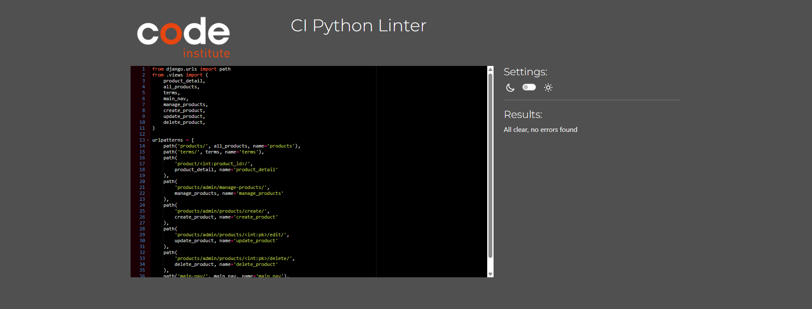<br><br>
Product - Urls.py

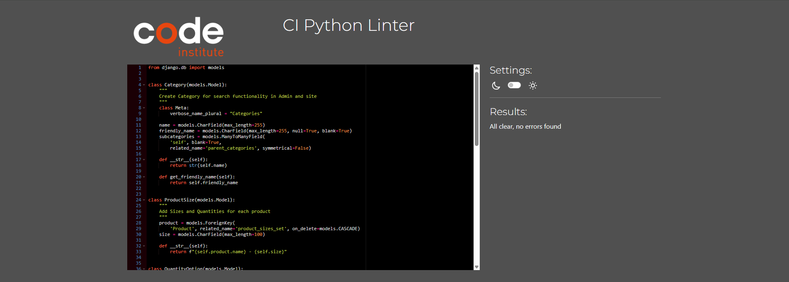<br><br>
Product - Models.py

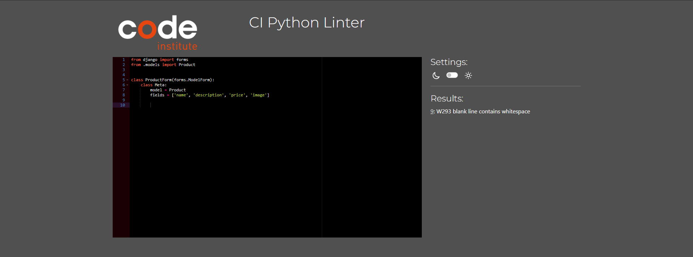<br><br>
Product - Forms.py

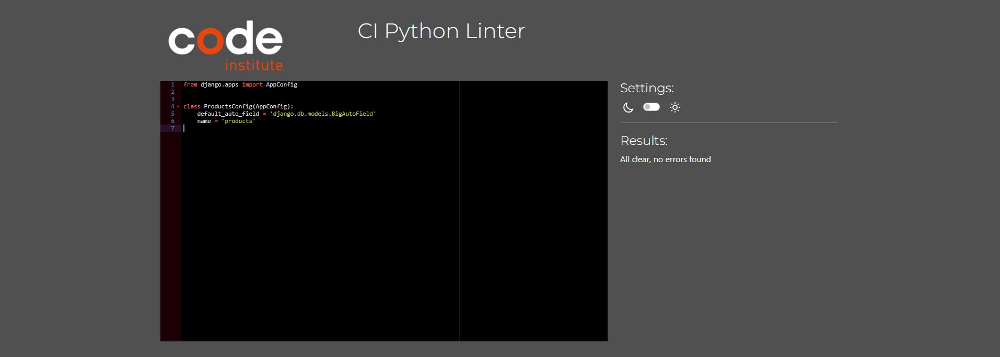<br><br>
Product - App.py

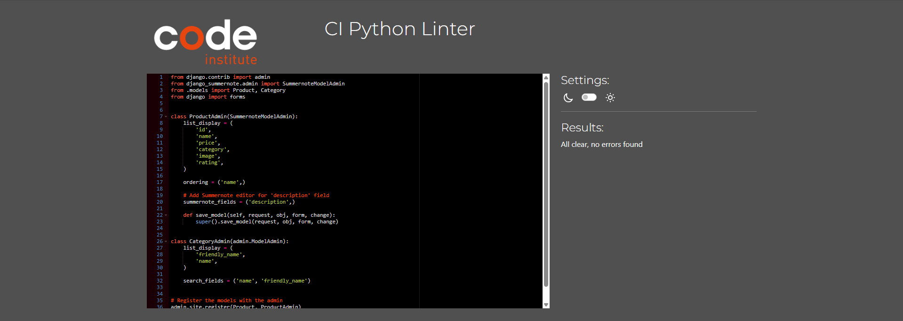<br><br>
Product - Admin.py

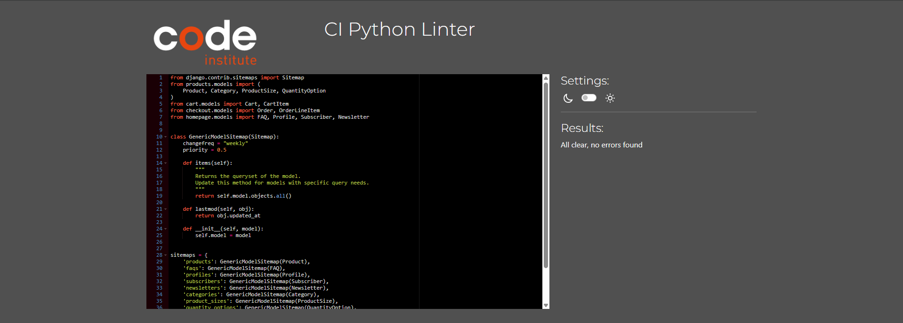<br><br>
Printe_design - Sitemaps.py

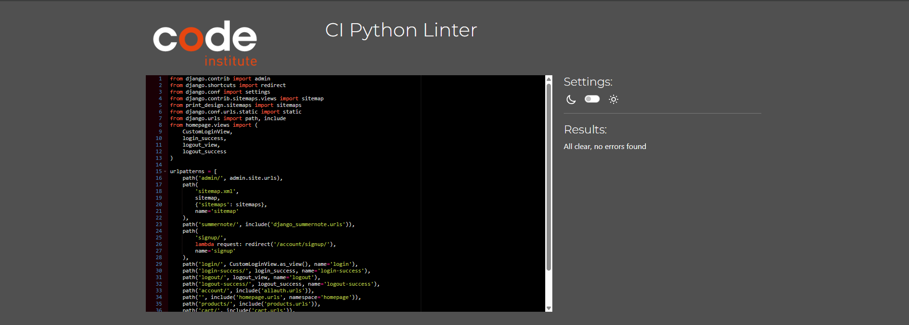<br><br>
Print_design - Urls.py

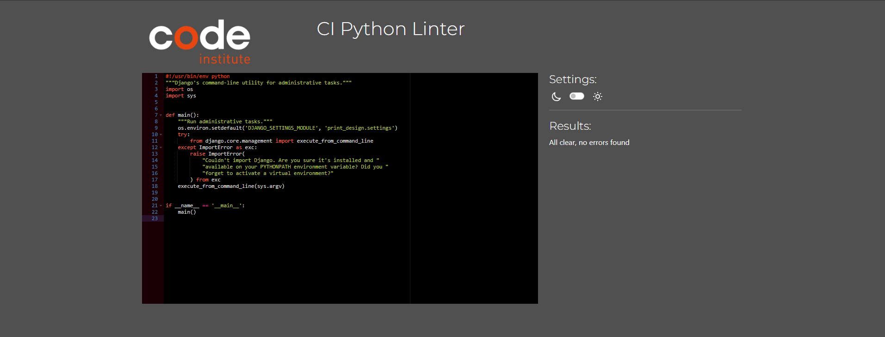<br><br>
Manage.py

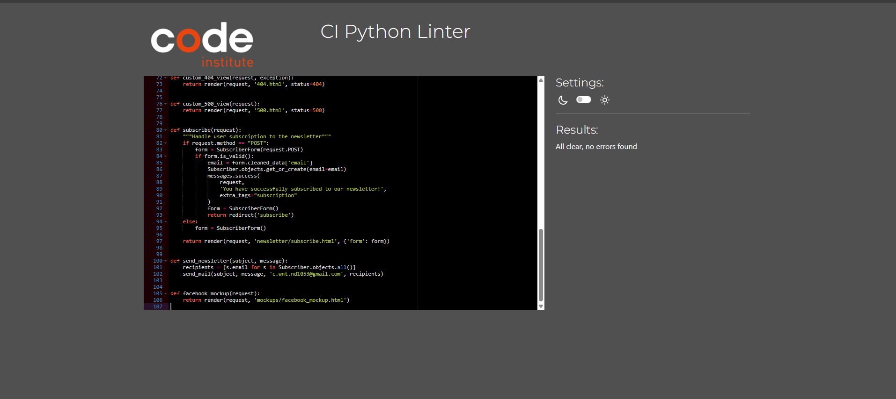<br><br>
Homepage - View.py

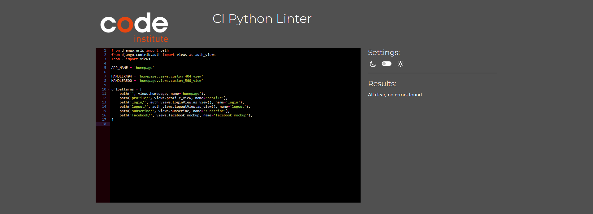<br><br>
Homepage - Urls.py

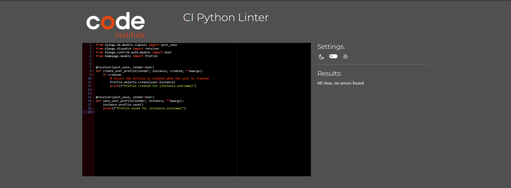<br><br>
Homepage - Signals.py

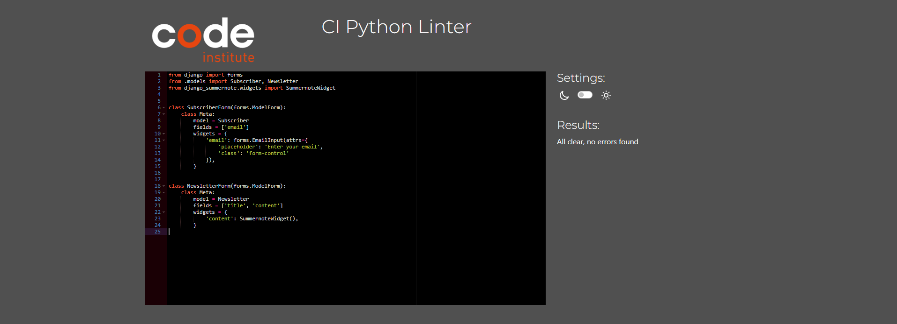<br><br>
Homepage - Forms.py

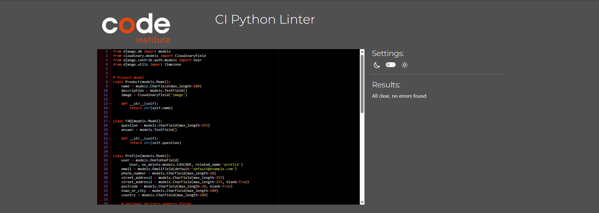<br><br>
Homepage - Model.py

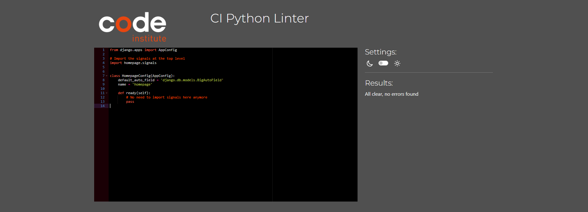<br><br>
Homepage - App.py

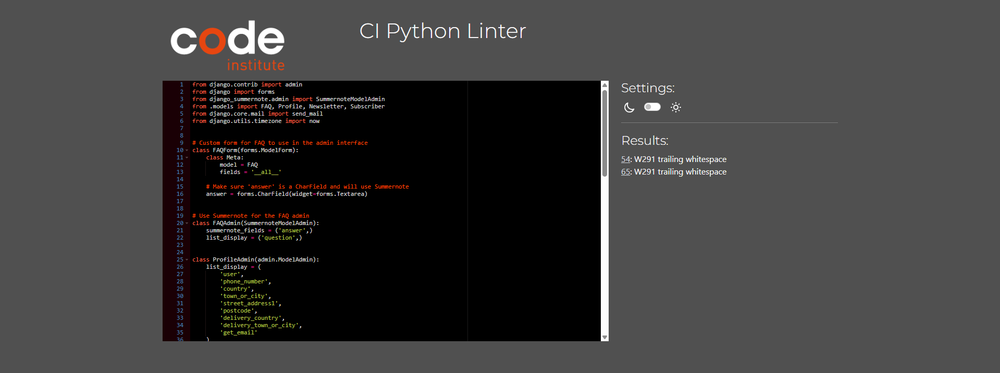<br><br>
Homepage - Admin.py

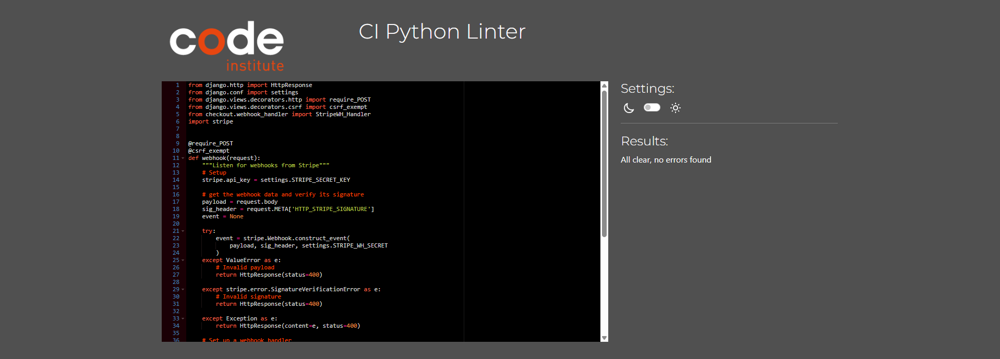<br><br>
Checkout - Webhooks.py

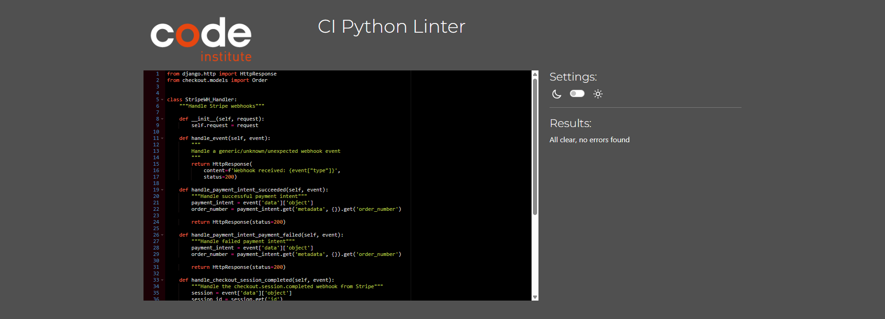<br><br>
Checkout - Webhook-handler.py

## CSS Validation

I used the CSS Validation service to test the site. (W3E Validator)[https://jigsaw.w3.org/css-validator/]

<br><br>
<br><br>

</details>

## JavaScript Validation

All javascript was put through the [JSHINT tool](https://jshint.com/)

<br><br>
cart.html.js

<br><br>
checkout.js

<br><br>
homoepage.html.js

<br><br>
product_detail.html.js

<br><br>
return.js

<br><br>
subscribtion.html.js

<br><br>
success.html.js


## HTML Validation

<details>

| Page | Validation Image |
|:---|:---: |
| Base.html  |    |
| Index  |    |
| Main Navbar |    |
| Mobile Navbar |    |
| Register |   |
| Log In |   |
| Log Out |   |
| Product |     |
| Product Details |     |
| Checkout |    |
| Checkout Success |    |
| Profile |   |
| About Us |   |
| Contact Us |   |
| Contact Us Success |   |
| Contact Us FAQ|    |
| Events |    |
| Newsletter |   |
| Wish List |   |
| Choosing Poster Article |  |
| All Compliance Pages |  |
| Footer |    |


</details>


<p align="right">(<a href="#contents">back to top</a>)</p>

## Lighthouse Validation


<details>

The scripts being in the header also caused lower scores and I added defer in some, defer in the Stripes linked caused it to stop working so I removed it.

***All pages scored 90% or above for accessibility.***

#### Index Page:
Accessibility was given a score of 90% first time around because of a missing ```<ul>``` element in the mobile header. Once that was added the score increased to 100% but the navbar stopped working on larger screens so I removed it.

<br>

<br><br>

SEO was given a 100% score overall

<br><br>

#### Registration Page:

<br><br>

#### Login Page:

<br><br>

#### Forgotten Password Page:

<br><br>

#### Products Page:
PNG images reduced score and can be changed to webp
Test results the same across all pages e.g. sort category price high to low, a-z, z-a, low to high price.

<br><br>

#### Checkout Page:

<br><br>

#### Checkout Success Page:

<br><br>

#### Profile Page:

<br><br>

#### About Page:

<br><br>

#### Contact Us Page:

<br><br>

#### Newsletter Page:

<br><br>

#### Event Page:

<br><br>


## Automated Testing


### Bugs

  #### Secret Key commited
  - I added the SK to the Js in order_checkout js for testing purposes,
      as the payment was throuwing Invalid Client Secret errors.
      Then I forgot to remove it before committing changes and opened a can of worms.
      I received a fatal error that Github piscked up that a SK was commit and
      refused access. I then proceeded to do a major rebate on all commits. After
      that I once again received the same error, as the commit was stuck in the
      history eventhough I did the rebate. After some restless sleep, I throught
      of just changing my SK in Stripe and allowing the old SK to be sent through
      as a test SK to Guthub. On the surface it seems to have worked.

  #### order dynamically move from current to previous order on status change
  - I am sure this is not a difficult fix, but due to time constraint I will need
    to complete this in future rollouts. The order status shows in the profile, can
    be changed in the admin Order model. But the update does not trigger the switch.

  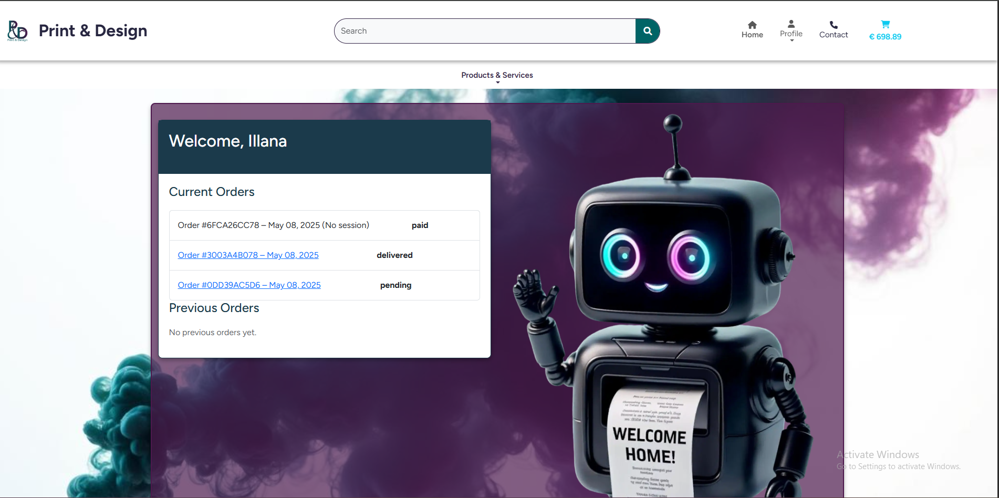<br><br>

## Resources

- [Pep 8 for code standards](https://peps.python.org/pep-0008/)
- [Black code formatter](https://pypi.org/project/black/)
- [Code Institute Python Tool](https://pep8ci.herokuapp.com/)
- [JSHINT tool](https://jshint.com/)
- [HTML validator](https://validator.w3.org/nu/#textarea)
- [CSS validator](https://jigsaw.w3.org/css-validator/)
- [Google Lighthouse](https://chromewebstore.google.com/detail/lighthouse/blipmdconlkpinefehnmjammfjpmpbjk)
- [Django Testing](https://developer.mozilla.org/en-US/docs/Learn/Server-side/Django/Testing)

## Retrospective

At the end of this process, I feel pretty dissatisfied. With the previous 4 projects I had ample time to give it my best, learn some additional things on the side etc. This, the last and most important project, the time  limit was simply inadequate. I had major problems along the way that caused me immense time wastage (the error in accidentally commiting the secret key) and then also made the initial error in choosing products that have a fixed quantity to price combinations. that was not at all straight forward to figure out for correct pricing.

<p align="right">(<a href="#contents">back to top</a>)</p>